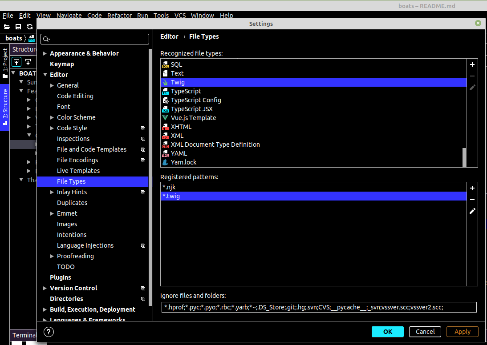
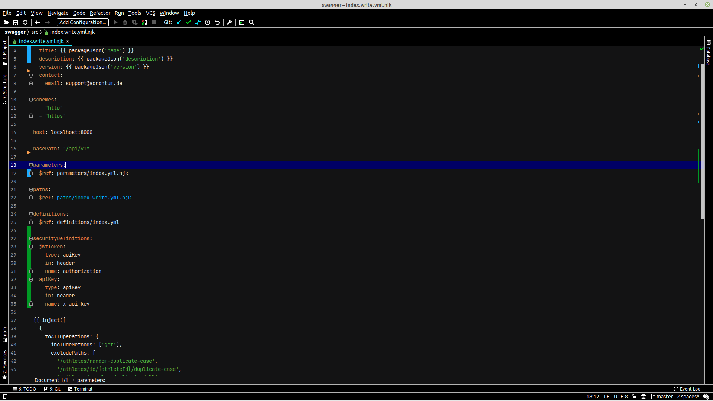

An OpenAPI & AsyncAPI templating system with Nunjucks... write less YAML... do more.


## Summary

---
An AsyncAPI/OpenAPI preprocessor tool with an aim to writer "DRY'er" source yaml files through the use of a template engine:
 - Bundle multiple yml files together with [json-schema-ref-parser](https://www.npmjs.com/package/json-schema-ref-parser)
 - Validate AsyncAPI output with [asyncapi/parser-js](https://github.com/asyncapi/parser-js)
 - Validate OpenAPI 2|3 output with [swagger-parser](https://www.npmjs.com/package/swagger-parser)
 - Use the full power of the [Nunjucks](https://mozilla.github.io/nunjucks/) templating engine within y(a)ml, type less do more
 - Nunjucks not enough? There is also [lodash](#lodash) functions baked in
 - Unique operation id's based on file location automatically
 - [Inject](#inject) common content and responses from a single point of control
 - Mixins within y(a)ml files
 - Variables within y(a)ml files
 - Include files with Typescript like shorthand via absolute paths in the boatsrc file
 - See [built in functions](#template-functions-built-in) below for more

Point boats at an entry index file and let it compile the rest automatically, either AsyncApi, OpenAPI or Swagger

## Getting started
Want to just see a demo up and running on your machine with no real effort... You can initialize a project via the init command. The net result will be:
 - Swagger2.0 or OpenAPI3 example files injected into your current project within a folder named src
 - Build scripts for JSON and YAML added to your package.json file for CLI use.

```
npm run boats -- --init
```

Want to start with a bare bones repo then just install and add these scripts to get going:
```json
{
  "name": "awesome-api-d",
  "description": "Awesome API Documentation - written in openapi",
  "version": "1.0.0",
  "scripts": {
    "boats": "boats",
    "build:json": "boats -i ./src/index.yml -o ./build/awesome-api-d.json",
    "build:yaml": "boats -i ./src/index.yml -o ./build/awesome-api-d.yml",
    "build": "npm run build:json && npm run build:yaml"
  },
  "dependencies": {
    "boats": "latest"
  }
}
```

## json-schema-ref-parser bundle and options

All openapi content is run through the bundle function found in https://github.com/APIDevTools/json-schema-ref-parser

The [bundle function](https://github.com/APIDevTools/json-schema-ref-parser/blob/master/lib/bundle.js) offers a few options that can be passed in.

In boats, you are able to pass these options in via 3 methods:
 - Create a .env file containing a JSON string of the options object under `jsonSchemaRefParserBundleOpts`
 - Create a process.env variable `jsonSchemaRefParserBundleOpts` containing a JSON string of the options
 - Add to your .boatsrc "jsonSchemaRefParserBundleOpts": { ... options }

The options passed in should be valid [bundle function](https://github.com/APIDevTools/json-schema-ref-parser/blob/master/lib/bundle.js) options.

## Dereference the output
When building pass the `-d` or `--dereference` option and the compiled swagger document will be passed via the [dereference](https://apitools.dev/swagger-parser/docs/swagger-parser.html#dereferenceapi-options-callback) method to fully dereference document. Helpful for when working with the likes of AWS for example.

## Validation
Errors are output to the console.

## .boatsrc

> TIP! The 2.0.0-rc1.1 release is on branch develop github - all links to the source point to master, make you sure switch

You can pass in options to BOATS via a `.boatsrc` file containing valid json. This is how you can control the nunjucks engine, eg [Nunjucks customer-syntax](https://mozilla.github.io/nunjucks/api.html#customizing-syntax). All nunjucks options found here will be merged into the default options.

A `.boatsrc` file should be a JSON representation of this interface:
- https://github.com/johndcarmichael/boats/blob/master/src/interfaces/BoatsRc.ts

- `nunjucksOptions` Overwrite the default nunjucks options eg the tag delimiters
- `jsonSchemaRefParserBundleOpts` Inject your own [jsonSchemaRefParserBundle](https://apitools.dev/json-schema-ref-parser/docs/options.html)
- `permissionConfig` Option will override how the `routePermission` [helper](#routePermission) prefixes routes (the default settings are shown above)
  - `methodAlias` An object of method alias overrides, please see the interface for the default options
  - `methodAliasPosition` Place the alias (default behavior) after the global prefix (if present) or at the end of the permission string
  - `globalPrefix` Defaults to true (prefix perms with the package.json name) else false for no prefix or a simple string for a custom prefix
  - `permissionStyle` The overall permission style, defaults to camelCase
  - `permissionSegmentStyle` The segment string style, defaults to camelCase (even when the main style is something else)
  - `generateSchemaNamed` Schema name to auto generate an enum with all available permission values (leave this empty or skip the option to disable this auto-generated schema)
- `picomatchOptions` An object of [picomatch#options](https://github.com/micromatch/picomatch#options)
- `paths` An object of key/value pairs that enable you to define [absolute paths](#absolute-paths) to be used in your templates. Similar to [Typescript's Paths compiler option](https://www.typescriptlang.org/tsconfig#paths)
- `fancyPluralization` Enables better pluralization for your model names (i.e. Universities instead of Universitys)

TIP: If you use the `.yml.njk`, you will want to just use the default tags from nunjucks (which may help IDE syntax highlighting). You can do this by removing the `nunjucksOptions` or by un-setting `nunjucksOptions.tags`:
```json
{
  "nunjucksOptions": {
    "tags": {}
  }
}
```
This will use the default template tags as show [in their docs](https://mozilla.github.io/nunjucks/templating.html).

## CLI
BOATS can be used as a cli tool via an npm script.

### All available arguments
The available arguments are best [read from the source](https://github.com/johndcarmichael/boats/blob/master/src/commander.ts).

### Examples
Example package.json script
```
"boats": "boats"
"build:yml": "boats -i ./src/index.yml -o ./build/api.yml"
```

If you have an existing repository with .yml files and want to convert to .yml.njk you can convert all the file extensions, and the references with one command:
```
npm run boats -- --convert_to_njk ./src
```

To convert all back to yml:
```
npm run boats -- --convert_to_yml ./src
```

## Programmatic Use
You can also use BOATS programmatically, just require (import if you are using a bundler) the lib into your project.

## Snippets
Snippets are prebuild files that can be injected into an existing file system, they can be pulled from a remote url or from a local disk.

There are a few snippets bundled with BOATS in the Snippets branch: https://github.com/johndcarmichael/boats/tree/snippets

Pull requests are welcomed for more snippets :)

Example use pull from remote url:
```
npm run boats -- -I https://github.com/johndcarmichael/boats.git#snippets -S oa2/crud -R ./src/paths -N beer
```

This will output:
- Fetch the snippet from the URL provided and write to a dir within the project
- The snippet renderer will then look for the optional -S flag, if present, use this subdir
- The snippets will then be copied to your project, then rendered with Nunjucks.

Example use pull from local disk:
```
npm run boats -- -I ../../mysnippets -S oa2/crud -R ./src/paths -N beer
```

This will output:
- Check the local dir of `../../mysnippets` exists
- The snippet renderer will then look for the optional -S flag, if present, use this subdir
- The snippets will then be copied to your project, then rendered with Nunjucks.


## Templating
As Nunjucks is used as the tpl engine, this means if you use a smart IDE such as intellij you are able to utilize the syntax highlight of both yml and njk.

If you come from a PHP world you will already be used to this with Twig, Blade or even back in the day with Smarty. These you will be used to viewing proper html syntax highlighting but at the same time good function/condition highlighting that the tpl engine offers.

Set your IDE to use the twig syntax for *.njk files:


Now your IDE will show both yaml and nunjucks styntax highlighting in one view without the swagger/openapi validator complaining but we can still jump through the files with "control+mouse click", eg:


Each file is passed through the Nunjucks templating engine meaning you can write Nunjucks syntax directly into the y(a)ml files, write loops, use variables, whatever you need.
BOATS ships with two helpful functions, `mixin` and `uniqueOpId`, but your also have the full power of the nunjucks templating functions available to you.

If you have not used [Nunjucks](https://www.npmjs.com/package/nunjucks) before, it is very similar to the Twig, Blade and Django templating language.

TIP: The tpl helpers and the examples in this repo all use the [default nunjucks helpers](https://mozilla.github.io/nunjucks/templating.html).

### File ext.
You may use `.yaml` or `.yml` or the `.njk` file extension.
Adding the .njk extension allows your ide to lay on nice syntax highlighting (for jetbrains, just add *.njk to the Twig mapping in you settings for file types).
You can switch from yml to njk via cli arguments.

There is an issue still with the `.njk` ext in that a reference to a file in another project on disk via `...yml.njk` will break as BOATS removes `.njk` after running through the nunjucks tpl engine.

### Absolute Paths

If managing relative links causes problems, it's possible to specify a shorthand for referring to absolute paths using the `paths` option in the `boatsrc` file.

Given a config like:

```json
{
  "paths": {
    "@mixins": "./src/mixins",
    "@components": "./src/components"
  }
}
```

You can reference a file under `./src/mixins` like so:

```yaml
{{ mixin("@mixins/response/pagination.yml.njk", "../generic/searchMeta.yml.njk", "./model.yml.njk", "--skip-auto-indent") }}

```

Or a schema can be referenced like:

```yaml
schema:
  $ref: @components/schemas/generic/searchMeta.yml.njk
```

### Auto Index Files
In async/swagger/openapi the channels/paths require an index file to register the routes.
By the way [json-schema-ref-parser](https://www.npmjs.com/package/json-schema-ref-parser), unless you create an index file then the references to component/definitions will not look pretty and easily break other tools.
Maintaining these index files is quite a monotonous chore, and very human error prone.

The index file is nothing more duplicate data; we already carefully name our folders and files to then manually go and type it all out again in a not fun to manage index file.

The easiest way to explain this is to look at the examples and their outputs:
- Paths indexer, https://github.com/johndcarmichael/boats/blob/master/srcOA3/paths/index.yml.njk resulting in the compiled file: https://github.com/johndcarmichael/boats/blob/master/build/builtOA3_1.0.1.yml#L18 This indexer expects to find single files within an end url segment folder to contain the avilable http verbs. Also not the curly braces for dynamic url parameters: https://github.com/johndcarmichael/boats/blob/master/srcOA3/paths/weather/id/%7Bid%7D/get.yml.njk
- Channel indexer, https://github.com/johndcarmichael/boats/blob/master/srcASYNC2/channels/index.yml.njk is slightly different to the paths as a single channel file is expected to contain all subscribe and publish data in on.
- Components|definitions|parameters indexer https://github.com/johndcarmichael/boats/blob/master/srcOA3/components/schemas/index.yml.njk will create a UpperCamelCase index file.

The 3 types of indexers:
Path Indexer
```
{{ autoPathIndexer() }}
```
Channel Indexer
```
{{ autoChannelIndexer() }}
```
Definition/Component/Parameter Indexer:
```
{{ autoComponentIndexer() }}
```
If you have an older set of BOATS files then you might have named the model files without the word model, to strip model from the naming:
```
{{ autoComponentIndexer('Model') }}
```

### Auto Summary
With the auto-summary tpl helper, the summary string is automatically calculated based on the rest path.

```yaml
summary: {{ autoSummary() }}
```

Example "**user/{id}/get.yml**" would yield "**Get user based on {id}**"

A more complex example, "**house/{number}/user/{id}/get.yml**" would output "**Get user based on {id}, from house {number}**"

See the unit tests for more examples, [src/__tests__/AutoSummary.spec.ts](https://github.com/j-d-carmichael/boats/blob/develop/src/__tests__/AutoSummary.spec.ts)

### Auto Tag
Calculates the tag based on the location of the file in the folder structure:
```yaml
tags:
  - <$ autoTag() $>
```

The following path:
`src/paths/temperature/get.yml`
Results in:
`Temperature`

The following path:
`src/paths/temperature/europe/get.yml`
Results in:
`Temperature`


### Custom template helpers / functions
It is possible to inject your own helper functions into the Nunjucks tpl engine. For example, you may wish to inject your own helper function that would automatically inject the package.json version number (bad example as you could use the above builtin function, but you get the idea) into the OpenAPI index file. This is how it would be done:

Pass to the cli tool a helper function path. The path should be relative to your entry point, typically where your `package.json` lives:
```
boats -i ./src/index.yml -o ./build/myapi.yml -f ./nunjucksHelpers/injectPackageJsonVersion.js -f ./someOtherHelper.ts
```

The `./nunjucksHelpers/injectPackageJsonVersion.js` should export a single default function:
```javascript
const packageJson = require('../package.json')
module.exports = () => {
  // assuming this is a valid package json file
  return packageJson.version
}
```

In your yaml file you can now access the custom function by file name:
```yaml
info:
  version: <$ injectPackageJsonVersion() $>
```

If the helper is a folder, boats will recursively add all js or ts files as helpers:
```
boats -i ./src/index.yml -o ./build/myapi.yml -f ./tplHelpers/
```

- Custom helpers are injected via the [Nunjuck's addGlobal function](https://mozilla.github.io/nunjucks/api.html#addglobal).
- A helper function should use the `function` keyword declaration to gain access to the nunjucks context.
- The name of the helper file will be the name of the function, non-alphanumeric (and _) characters will be stripped.
- You can write your helper in either TypeScript or Javascript

### inject

The inject helper allows you to inject content to many operations from a single block.

Path maching is handled via [picomatch](https://github.com/micromatch/picomatch#picomatch-options), you are able to inject your own options via the `.boatsrc` file. The default options are
```
  "picomatchOptions": {
    "bash": true
  },
```

Anatomy of the injection:
```yaml
{{
  inject([                        # The inject block accepts an array of objects with options described below
    {
      toAllOperations: {
        content: {                # Required - the content to inject to each, can be anything you choose. Restrictions are only valid async/openapi syntax
          security: [{            # path or channel, filtered by the options
            apiKey: []            # below.
          }]
        },
        excludeChannels: [        # Optional - string array containing channels
          '/user_messages/**'     # to exclude (parsed with https://github.com/micromatch/picomatch)
          '/system_information'
        ],
        includeOnlyChannels: [    # Optional - string array containing channels
          '/admin/**'             # only include these channels (parsed with https://github.com/micromatch/picomatch)
        ],
        excludePaths: [           # Optional - string|object array containing paths or paths and methods
          '/users',               # to exclude (parsed with https://github.com/micromatch/picomatch)
          {
            path: '/car/*',       # Exclude all car paths where the method is get
            methods: [
              'get'
            ]
          }
        ],
        includeOnlyPaths: [       # Optional - string array containing channels
          '/admin/**'             # only include these paths (parsed with https://github.com/micromatch/picomatch)
          {
            path: '/car/*',       # Include all car paths where the method is post/put/delete
            methods: [
              'post',
              'put',
              'delete'
            ]
          }
        ],
        includeMethods: [         # Optional - string array containing method
          'post',                 # whitelist (default is all methods)
          'put',
          'patch',
          'delete'
        ]
      }
    }
  ])
}}
```
In the example below we are injecting a header parameter to every path method:
Example: https://github.com/johndcarmichael/boats/blob/master/srcOA2/index.yml.njk#L43

For openapi, the content will be merged/concat/injected into paths that are not excluded.

For asyncapi, the content will be merged/concat/injected into [channels](https://github.com/johndcarmichael/boats/blob/master/srcASYNC2/index.yml#L19).

Content is either a JSON representation of the YAML content to inject, or a string:
```yaml
# index.yaml
# ...

{{
  inject([

    # add auth to all routes
    {
      toAllOperations: {
        content: {
          security: [{
            jwtToken: []
          }]
        }
      }
    },

    # add x-write and api key to all post, put, patch, delete calls to routes
    # except for /users
    {
      toAllOperations: {
        excludePaths: ['/users'],
        includeMethods: ['post','put','patch','delete'],
        content: {
          x-write-required: '{{ routePermission() }}'
          security: [{
            apiKey: []
          }]
        }
      }
    },

    # add defaults to all routes
    {
      toAllOperations: {
        content: '
          tags:
            - {{ autoTag() }}
          summary: {{ myCustomAutoSummary() }}
          operationId: {{ uniqueOpId() }}
          description: |
            {{ myCustomDescription() }}
          responses:
            '404':
              description: Not found
              schema:
                $ref: #/common/404.yml.njk
            '401':
              description: Unauthenticated
              schema:
                $ref: #/common/401.yml.njk
            '418':
              description: Error brewing coffee
              schema:
                $ref: #/common/418.yml.njk
        '
      }
    }
  ])
}}
```

Type less do more.

### lodash 
Nunjucks is a powerful template engine with a lot out of the box, but we wanted more so we injected lodash into the mix.

Whatever you find in their docs https://lodash.com/docs/4.17.15 you can use in your boats files.

To access lodash in your templates just ensure you preface your function with the _:
```yaml
info:
  version: 1.0.1
  title: {{ _.camelCase( packageJson('name') ) }}
```

(you can see the injection of lodash into nunjecks here: [src/Template.ts#L286](https://github.com/j-d-carmichael/boats/blob/main/src/Template.ts#L286))


### merge
allOf equiv. for when allOf is not supported.
```
{{ merge('../userAgent/model.yml', '../userIp/model.yml') }}
```

### mixin
Example use:
```yaml
Weathers: mixin("../../mixins/pagination.yml", "#/components/schemas/GenericSearchMeta", "#/components/schemas/Weather")
```

The `mixin` gives function to OpenAPI files that previously meant a lot of repetitive typing which results in less human error. With mixins you are able to wrap definitions/components in common content. For example [pagination](https://github.com/johndcarmichael/boats/blob/master/srcOA3/paths/v1/weather/get.yml#L9).

The mixin function assumes the 1st given argument to be the relative path to the mixin template yaml file.

All additional arguments are passed as numbers variables to the Nunjucks templating engine `var<argument index>` eg `var1`

Mixin file [example here](https://github.com/johndcarmichael/boats/blob/master/srcOA3/mixins/response/json.pagination.yml) and [here](https://github.com/johndcarmichael/boats/blob/master/srcOA3/mixins/request/json.yml).

The mixin will automatically calculate indents. If you use a mixin for plural models [like this](https://github.com/johndcarmichael/boats/blob/master/srcOA3/components/schemas/weather/models.yml.njk), then an additional argument can be added to the end:
```
{{ mixin("../../../mixins/response/pagination.yml.njk", "../generic/searchMeta.yml.njk", "./model.yml.njk", "--skip-auto-indent") }}
```

In most cases the additional indentation which not break anything, but if a clean partial output file is required...

### packageJson
Example use:
```yaml
openapi: "3.0.0"
info:
  version: <$ packageJson('version') $>
```

Returns the value of an expected attribute to be found in your `package.json` or throws an error.


### pickProps

It takes the definitions path as the first parameter, and an array of strings or rest parameters specifying props to pick:
```
{{ pickProps('path', 'prop1', 'prop2') }}
```
or
```
{{ pickProps('path', ['prop1', 'prop2']) }}
```

For example, a model file with many attributes might look like:
```
type: object
required:
  - name
  - coordinates
properties:
  name:
    type: string
  coordinates:
    type: array
    items:
      type: string
  ... etc etc
```

Another definition doesn't want this whole definition, just a part, but we don't want juggle around with complex openapi inheritance features, so pickProps can be used instead:
```
{{ pickProps('./post.yml.njk', 'name') }}
```

The output would be:
```
LocationPut:
  type: object
  required:
    - name
  properties:
    name:
      type: string
```

### Process Environment Variables
During automated build chains it is not uncommon for api keys and dynamic URIs to be injected into the outputted OpenAPI files, this is common with AWS's cloud formation when used with dynamic containers.

To accommodate this, all `process.env` variables are exposed in read-only format to the templates.

To enable easier development with `process.env` variables BOATS also makes use of the [dotenv](https://www.npmjs.com/package/dotenv) package during cli use only.

If a `.env` file is found at the root of your project then this will be parsed by dotenv and subsequently be made available to the Nunjucks engine as a tpl variable.

> !Tip: Do not add the .env file to your git repo, this is only for development purposes, read the [dotenv](https://www.npmjs.com/package/dotenv) docs. Your CI tool should use proper env variables during a build chain.

### optionalProps

Allows inheritance from a referenced object definition but makes all properties optional, i.e, it drops the required object prop.

Usage:

```yaml
{{ optionalProps() }}
```

With OA3 inheritance

```yml
allOf:
  - {{ optionalProps() }}
```

Example

Given a referenced file defined as follows:

`post.yml`

```yaml
type: object
required:
  - name
  - coordinates
properties:
  name:
    type: string
  coordinates:
    type: array
    items:
      type: string
```

And the helper used as follows:

`patch.yml`

```yaml
{{ optionalProps('./post.yml.njk') }}
```

Will produce

`patch.yml`

```yml
type: object
properties:
  name:
    type: string
  coordinates:
    type: array
    items:
      type: string
```


### routePermission
Adds a configurable prefix to the `uniqueOpId` [helper](#uniqueOpId), allowing for method-based permissions for access control.

`weather/post.yml` would result in `createWeatherPost`:
```yaml
tags:
  - <$ autoTag() $>
description: List all users
x-permission: <$ routePermission() $>
```

You should name the attribute something that fits your generator, `x-permission: ...` is configured to work with [generate-it's](https://www.npmjs.com/package/generate-it) typescript [express server templates](https://github.com/acrontum/openapi-nodegen-typescript-server/blob/master/src/http/nodegen/routes/___op.ts.njk#L28).

You may also:
- Instruct the helper to strip out the method, turning `weather/post.yml` into `createWeather`.
- Add a custom tail string to the output
- Add a custom prefix to the start of the output

Here is a kitchen sink example:
```


{{
  inject([{
    toAllOperations: {
      includeOnlyPaths: ['/admin/**'],
      content: {
        'x-permission': '{{ routePermission( {prefix: \''+ prefix +'\', removeMethod: true, tail: \''+ tail +'\'} ) }}'
      }
    }
  }])
}}
```

The method conversion defaults are:
```
get: 'read',
post: 'create',
put: 'update',
patch: 'update',
delete: 'delete',
```

Of course, you can remote control the injection of the permissions to all routes from the [inject helper](#inject).

### uniqueOpId
Example use:
```yaml
tags:
  - temperature
summary: Temperature data
description: Get the latest temperature
operationId: <$ uniqueOpId() $>
```
The `uniqueOpId` function reduces human error by automatically returning a unique identifier based on the files location within the file system.
The path leading up to the entry point is always removed.
In addition the value of the "strip_value" command is also removed, if a strip value is not provided this will default to "src/paths/".

So the following path:
`/home/me/code/project/src/paths/v1/temperature/get.yml`

Results in:
`v1TemperatureGet`

Each segment of the path is run through [camelcase](https://github.com/sindresorhus/camelcase#readme) so `this-folder` results in `thisFolder`

This is especially helpful for API generators eg: codegen


### Variables
In addition to Nunjucks ability to set variables within template files: https://mozilla.github.io/nunjucks/templating.html#set

You can also pass in custom variables to your templates with the --variables option:
```
npm run boats -i ./src/index.yml -$ host=http://somedomain.com -$ email=john@boats.com
```

The variables can then be accessed via the normal nunjucks syntax eg:
```
url: <$ host $>
```

> !Tip: These variables will override any variables injected into the tpl engine from the `process.env`

## Changelog
- 2022/06/08 2.34.1: Fixed: recursive helpers ignore files other than js/ts
- 2022/05/15 2.34.0: Changed: cli helpers `-f helper` will recursively add helpers from a folder when specified
- 2022/03/26 2.33.0: Security updates
- 2022/03/26 2.32.0: Fix: map channels index [issues/70](https://github.com/j-d-carmichael/boats/issues/70)
- 2022/03/26 2.31.0: Fix: ts-node require once [issues/69](https://github.com/j-d-carmichael/boats/issues/69)
- 2022/03/17 2.30.0: `{{ autoSummary() }}` no longer wrapped in quotes
- 2022/03/12 2.29.0: New template helper, `{{ autoSummary() }}` generates summary string based on url path
- 2021/12/15 2.28.0: js-yaml upgraded to 4.1.0 replacing safeDump|Load to their new home
- 2021/12/08 2.27.0: docs - readme
- 2021/12/08 2.26.0: --dontValidateOutput added, does what you think it might :) and switched to @apidevtools/swagger-parser to fix a ghostly bug 👻
- 2021/10/05 2.25.0: allow loading of helper files in TypeScript using ts-node
- 2021/09/19 2.24.0: npm version check updated to use npm api instead of github json url
- 2021/09/19 2.23.0: npm version check updated
- 2021/09/13 2.22.0: (TEMP) The npm / github version check is removed to bypass github stalling issues
- 2021/09/13 2.21.0: Allow overwriting of existing schema when the permissions schema is created
- 2021/09/10 2.20.0: Add an option to automatically generate an enum schema with all available permissions
- 2021/09/09 2.19.0: Absolute paths now work for multiple path shorthands in 1 file
- 2021/09/09 2.18.0: Init fixes
- 2021/09/09 2.17.0: Rollback
- 2021/09/08 2.16.0: Absolute paths in the .boatsrc file
- 2021/09/07 2.15.0: The boatsrc is injected via the init function is 1 does not already exist
- 2021/08/31 2.14.0: Fancy pluralisation added to the model naming
- 2021/08/31 2.13.0: skipped as 13 is not a lucky number :b
- 2021/06/28 2.12.0: windows compatibility
- 2021/06/27 2.11.0: relative mixins added
- 2021/06/24 2.10.0: boats init now offers async api
- 2021/06/21 2.9.0:  schemaRef helper for OA3 discriminator
- 2021/01/28 2.8.0:  boats init package file as private
- 2020/12/14 2.7.0:  pickProps added, allowing simple object building from props of another
- 2020/12/12 2.6.0:  Inject include/exclude now takes string[] or {path:string, method: string}[] for finer control
- 2020/11/15 2.5.0:  Merge objects added for when allOf is not possible
- 2020/11/09 2.3/4:  Snippets extracted out of the core, now pulled from remote or local
- 2020/11/08 2.2.0:  Snippets feature added for faster scaffolding into an existing project
- 2020/11/07 2.1.0:  Support for the windows file system
- 2020/08/29 2.0.0:  Route permissions will auto inject a namespace by default, this is a breaking change from v1 behaviour. To prevent set globalPrefix to false
- 2020/08/28 1.25.4: Rollback to 1.24.1 to revert the breaking change
- 2020/08/28 1.25.0: A breaking change was released to live, sorry
- 2020/08/27 1.24.0: feat: Add `-y`, `--yes` option to skip remote version check
- 2020/08/26 1.23.0: feat: Add prefix to permissions `{{ routePermission({prefix: 'ms-authentication', removeMethod: true}) }}`
- 2020/08/26 1.22.0: feat: tpl helper [optionalProps](https://johndcarmichael.github.io/boats/#/?id=optionalprops) added AND [glob pattern matching for the injector](https://johndcarmichael.github.io/boats/#/?id=inject), aka wildcards
- 2020/08/25 1.21.0: feat: options added to routePermission helper: x-permission: `{{ routePermission({removeMethod: true}) }}` strips the method off the generated permission name.
- 2020/08/13 1.20.4: docs: readme
- 2020/08/13 1.20.2: fix: --init script
- 2020/08/13 1.20.0: feat: now uses the new https://www.npmjs.com/package/@asyncapi/parser which enforces all operationId to all be unique and brings in Types.
- 2020/08/11 1.19.0: feat: pass [json-schema-ref-parser options](https://github.com/APIDevTools/json-schema-ref-parser/blob/master/lib/bundle.js#L17) via process.env or .boatsrc file allowing header injection for url resolution
- 2020/07/28 1.18.5: feat: handle # refs instead of trying to resolve them as files
- 2020/06/28 1.18.1: chore: Bump tool check version to 1.1.1
- 2020/06/28 1.18.0: feat: Conversion to typescript
- 2020/06/18 1.17.0: feat: Allow njk templating in injected content and a new function routePermission()
- 2020/05/03 1.16.1: fix: Allow a channel in asyncAPI to have the same id for subscribe and publish, but not across multiple channels (see the test example)
- 2020/05/03 1.16.0: feat: An additional unique operation id check during the bundle process.
- 2020/05/03 1.15.0: feat: Calculate the strip value based on the input type, src/paths or src/channels
- 2020/04/30 1.14.0: feat: Cli args --convert_to_njk <localDirectory> and --convert_to_yml <localDirectory> added and documented
- 2020/04/27 1.13.0: feat: New feature for the tpl helper: nunjucksHelpers/autoComponentIndexer.js to [remove](https://github.com/johndcarmichael/boats/blob/master/srcOA3/components/schemas/index.yml.njk) a string from the def/comp/param. leaving [different naming](https://github.com/johndcarmichael/boats/blob/master/build/builtOA3_1.0.1.yml#L123).
- 2020/04/26 1.12.2: chore: Dependency updates, moved to @asyncapi/parser from asyncapi-parser
- 2020/04/26 1.12.1: docs: Readme for npm
- 2020/04/26 1.12.0: feat: Auto indexer tpl helpers based on directories and files ([paths/index](https://github.com/johndcarmichael/boats/blob/master/srcOA3/paths/index.yml.njk), [channels/index](https://github.com/johndcarmichael/boats/blob/master/srcASYNC2/channels/index.yml.njk), [components|definitions|parameters index](https://github.com/johndcarmichael/boats/blob/master/srcOA3/components/schemas/index.yml.njk)).. less donkey work.
- 2020/04/15 1.11.0: feat: Using deepmerge in the `inject` helper for more complex injections; [srcOA2/index.yml.njk](https://github.com/johndcarmichael/boats/tree/master/srcOA2)
- 2020/04/12 1.10.0: deat: Auto detection of input type, asyncapi, openapi or swagger. -t cli arg no longer present
- 2020/04/12 1.9.0: feat: Expose convert to njk file ext, --convert_to_njk ./src
- 2020/04/12 1.8.0: feat: New tpl helper fileName & uniqueOpId bug fix for .njk files
- 2020/04/07 1.7.5: docs: better examples readme links.
- 2020/04/07 1.7.4: fix: Bug fix only the 1st inject block found is respected, ignore subsequent blocks found.
- 2020/04/07 1.7.3: chore: dependency update, camelcase
- 2020/04/07 1.7.2: fix: relating to "inject" new option "includeMethods"
- 2020/04/03 1.7.1: fix: PR from @CasperJ to fix windows build environments
- 2020/03/30 1.7.0: feat: Tpl helper "inject" new option "includeMethods"
- 2020/03/28 1.6.0: feat: New tpl helper "inject" common content to paths/channels inc. exclude list
- 2020/03/28 1.5.0: feat: .njk ext support allowing std nunjucks tags, tip: .boatsrc
- 2020/03/08 1.4.0: feat: Added ability to build and validate AsyncAPI yml files
- 2020/01/25 Dependencies updated and unique of id 1st segment bug fix
- 2019/11/04 Expose the dereference of swaggerparser via the new -d | --dereference cli argument
- 2019/07/14 Security update from [inquirer](https://www.npmjs.com/package/inquirer)


## Thanks To
BOATS is nothing more than a connection between other packages so big thanks to:
 - Everyone at @apidevtools
 - Everyone at @asyncapi
 - vitaly for js-yaml
 - The team behind nunjucks and lodash
